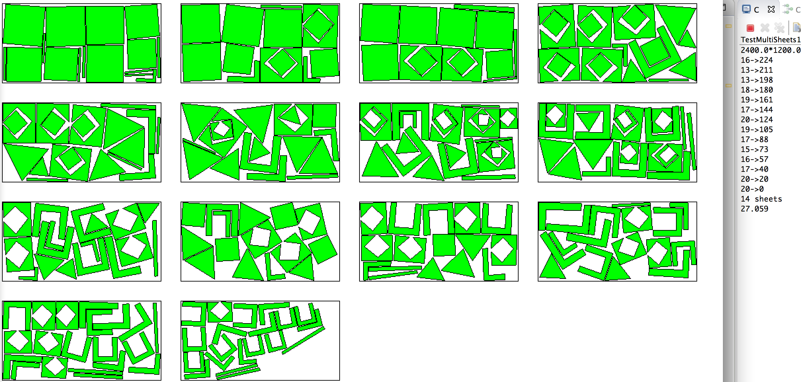

# Dalsoo-Bin-Packing

A java library for 2D irregular shape packing in rectangular sheets. Algorithms are adapted from papers of Abeysooriya 2018 and Dalalah 2014. Bin packing places a given set of polygons in standard single/multiple rectangular sheet(s), to minimize the use of the sheet(s).

This library does not involve other libraries, however, the example uses core.jar (https://processing.org) for a graphical interface. The algorithm is effective when the ratio  (number of polygons / number of the types of polygons) is small.

The processing user needs to create “…/libraries/dalsoo/library/dalsoo.jar”, and then write “import pack.*;” to import the library.

## 1. Input 

**a**. Only simple polygon: no holes, no self-intersection.

**b**. Data structure: point - double[];  polygon - double[][]; all polygons - double[][][]. 
One might use other library to convert  other formats (e.g., dxf, obj) of polygon to double[][].

**c**. It's better to represent a polygon with a moderate number of points. 
Too many points (e.g. a local detail contains dozens of points) slows down the algorithm. Avoid using too many points for a smooth curve.
One might use *segment_max_length* to let the algorithm create more points on a long straight edge of a polygon, if the polygon has very few points or the edge is very long.

## 2. Choose an algorithm

**a**. *useAbey*=true, *Jostle heuristics for the 2D-irregular shapes bin packing problems with free rotation, R. P. Abeysooriya et al. 2018*. However, Jostle method is not used.

*rotSteps*:  Each polygon is rotated in the layout. Few steps (say 16) -> run fast  & poor result;  many steps (say 48) -> run slow & good results

*segment_max_length*: if (an edge of a polygon > segment_max_length),  breaks it into smaller segments. 
large value -> run fast  & poor result; small value -> run slow & good results

*segment_max_length* is related to translation steps.

**b**. *useAbey*=false, *Waste minimization in irregular stock cutting, D. Dalalah et al. 2014*

the rotation/translation steps depend on the polygons.

## 3. Output options

**a**. obtain the transformation of each polygon in the final layout, including:

int[] *result_pack_id*;  // result_pack_id[8]=2 means the 9th polygon is on the 3rd sheet.

double[][] *result_cos_sin*; // result_cos_sin[8]={0.5, 0.866} means the 9th polygon is rotated 60 degree around (0,0).

double[][] *result_position*; // result_position[8]={7.4, 9.0} means that the 9th polygon should be translated by (7,4, 9.4) after rotation.

**b**. obtain the geometry of each polygon in the final layout 

Pack pack = packs.get(id);   //obtain a sheet (pack) by id.

for (Strip strip : pack.fixs) { // obtain a placed strip (polygon) in a sheet.

strip.inps // the polygon's points, one might use other library to convert double[][] to other formats (e.g., dxf: https://github.com/whitegreen/DXF-Laser) of polygon 

}

 in red. The convex of all polygons in one sheet is in green.")

